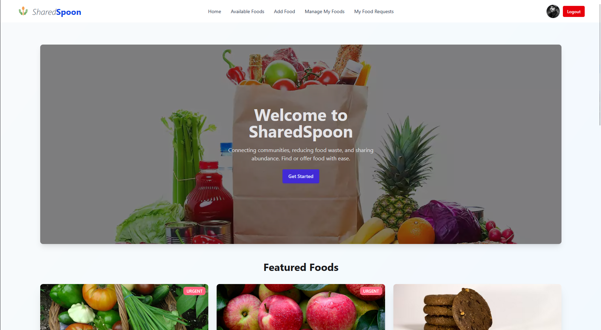

# SharedSpoon - Food Sharing Platform

## Purpose

SharedSpoon is a full-stack web application designed to connect individuals and organizations with surplus food to those in need within their community. The platform aims to reduce food waste and facilitate food sharing by providing an easy-to-use interface for donating and requesting food items.

## Live URL

[https://a11-food-sharing.web.app/](https://a11-food-sharing.web.app/)

## Live Demo Screenshot



## Key Features

*   **User Authentication:** Secure registration and login using Firebase (Email/Password and Google Sign-In).
*   **JWT Authentication:** Custom JWT tokens generated by the server for secure API communication after Firebase authentication.
*   **Food Listings:**
    *   Users can add new food items they want to donate, including details like name, image, quantity, pickup location, expiration date, and additional notes.
    *   View all available food items, sortable and searchable.
    *   Featured foods section on the homepage.
*   **Food Management (for Donors):**
    *   Donors can view, update, and delete their own listed food items.
*   **Food Requests (for Requesters):**
    *   Users can view details of available food items.
    *   Authenticated users can request food items.
    *   Users can view a list of their own food requests.
*   **Responsive Design:** User interface adaptable to various screen sizes using Tailwind CSS and DaisyUI.
*   **Interactive UI:** Smooth animations and transitions using Framer Motion.
*   **Dynamic Theming:** Light and dark mode support with a theme toggle to enhance user experience.
*   **Notifications:** User feedback through toast notifications for actions like login, registration, adding food, etc.
*   **Private Routes:** Certain pages and functionalities are protected and accessible only to authenticated users.

## Technology Stack & NPM Packages Used

This project is a MERN-stack application (MongoDB, Express.js, React, Node.js) with Firebase for authentication.

### Client-Side (`a11-food-sharing-client`)

*   **Core:**
    *   `react`: A JavaScript library for building user interfaces.
    *   `react-dom`: Serves as the entry point to the DOM and server renderers for React.
*   **Routing:**
    *   `react-router-dom`: For declarative routing in React applications. (Note: imported as `react-router` in some files, but `react-router-dom` is the typical package for web apps).
*   **State Management & Data Fetching:**
    *   `@tanstack/react-query`: For fetching, caching, synchronizing and updating server state.
    *   `@tanstack/react-query-devtools`: Devtools for TanStack Query.
*   **Authentication (Firebase):**
    *   `firebase`: Firebase SDK for JavaScript.
*   **Styling & UI:**
    *   `tailwindcss`: A utility-first CSS framework.
    *   `daisyui`: A Tailwind CSS component library.
    *   `framer-motion`: For animations and gestures.
*   **Notifications:**
    *   `react-toastify`: For displaying toast notifications.
*   **Build Tool:**
    *   `vite`: A fast build tool and development server.
    *   `@vitejs/plugin-react`: Vite plugin for React.
    *   `@tailwindcss/vite`: Tailwind CSS integration for Vite.
*   **Linting:**
    *   `eslint`: For identifying and reporting on patterns in JavaScript.
    *   `@eslint/js`
    *   `eslint-plugin-react-hooks`
    *   `eslint-plugin-react-refresh`
    *   `globals`

### Server-Side (`a11-food-sharing-server`)

*   **Framework:**
    *   `express`: Fast, unopinionated, minimalist web framework for Node.js.
*   **Database:**
    *   `mongodb`: Official MongoDB driver for Node.js.
*   **Authentication & Authorization:**
    *   `jsonwebtoken`: For generating and verifying JSON Web Tokens (JWTs).
    *   `firebase-admin`: Firebase Admin SDK for server-side operations.
*   **Middleware & Utilities:**
    *   `cors`: For enabling Cross-Origin Resource Sharing.
    *   `dotenv`: For loading environment variables from a `.env` file.

## API Endpoints

*   `POST /api/auth/generate-token`: Verifies a Firebase ID token and issues a custom JWT for the session.
*   `GET /api/foods`: Retrieves all available food items for public viewing. Supports searching and sorting.
*   `GET /api/foods/:id`: Fetches details for a single food item.
*   `POST /api/foods`: (Protected) Adds a new food item to the database.
*   `PUT /api/foods/:id`: (Protected) Updates a food item owned by the authenticated user.
*   `DELETE /api/foods/:id`: (Protected) Deletes a food item owned by the authenticated user.
*   `GET /api/my-foods`: (Protected) Retrieves all foods added by the currently logged-in user.
*   `POST /api/food-requests`: (Protected) Allows a user to request a food item, changing its status.
*   `GET /api/my-food-requests`: (Protected) Retrieves a list of all food items requested by the current user.

## Getting Started

### Prerequisites

*   Node.js and npm (or yarn) installed.
*   MongoDB Atlas account (or local MongoDB instance).
*   Firebase project set up.

### Client Setup (`a11-food-sharing-client`)

1.  Navigate to the `a11-food-sharing-client` directory.
2.  Install dependencies: `npm install`
3.  Create a `.env` file in the root of the client directory and add your Firebase configuration:
    ```env
    VITE_FIREBASE_API_KEY=your_api_key
    VITE_FIREBASE_AUTH_DOMAIN=your_auth_domain
    VITE_FIREBASE_PROJECT_ID=your_project_id
    VITE_FIREBASE_STORAGE_BUCKET=your_storage_bucket
    VITE_FIREBASE_MESSAGING_SENDER_ID=your_messaging_sender_id
    VITE_FIREBASE_APP_ID=your_app_id
    ```
4.  Start the development server: `npm run dev`

### Server Setup (`a11-food-sharing-server`)

1.  Navigate to the `a11-food-sharing-server` directory.
2.  Install dependencies: `npm install`
3.  Create a `.env` file in the root of the server directory:
    ```env
    PORT=3000
    DB_USER=your_mongodb_username
    DB_PASS=your_mongodb_password
    JWT_SECRET=your_super_secret_jwt_key
    # Add your MongoDB connection string if not using user/pass directly in URI
    # MONGODB_URI=mongodb+srv://<username>:<password>@cluster....
    ```
4.  Download your Firebase Admin SDK JSON key file, rename it to `firebase-admin-sdk.json`, and place it in the root of the `a11-food-sharing-server` directory. **Ensure this file is added to your `.gitignore`**.
5.  Start the server: `npm start` (or `nodemon index.js` if you have nodemon installed for development).

---
